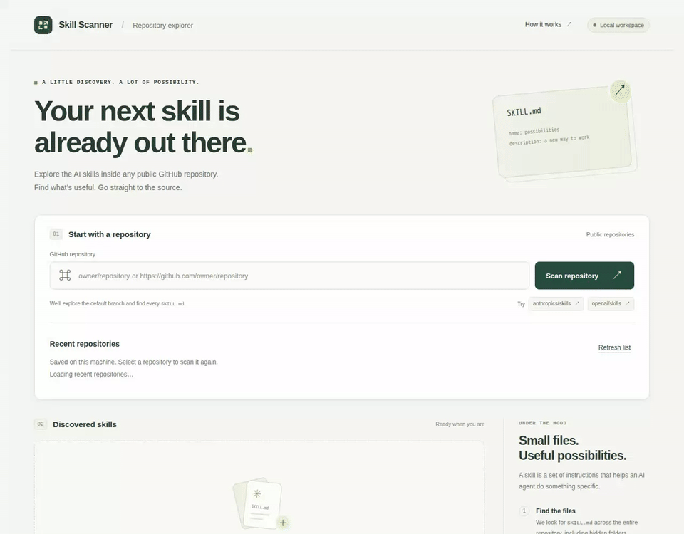

# Recent repositories demonstration

[Watch the MP4 version](recent-repositories.mp4).

This recording comes from the passing
[recent repositories E2E test](../../tests/e2e/recent-repositories.spec.mjs),
with baseline updates disabled. The [recording manifest](recent-repositories.json)
identifies the tested source revision, pinned browser environment, screenshot
checkpoints, pass result, and media hashes. A later media-only commit adds the
recording without changing the tested source or baselines.

The test drives the rebuilt executable using
[local scan fixtures](../../tests/e2e/fixtures/scans.json), isolated history and
cache directories, and no credentials or live GitHub access. Scan responses
and their history writes are mocked; listing, removal, server restarts, and
CLI history reads use the actual application and persistent storage. Rust tests
separately verify successful scans record history.

Nine [reviewed screenshot baselines](../../tests/e2e/snapshots/recent-repositories.spec.mjs)
cover empty history, scanning, the first scan, newest-first order, restart
persistence, keyboard selection, an updated repeat scan, removal with current
results retained, and persistent removal after another restart. Behavioral
assertions run before each comparison. The same run verifies CLI sharing,
disabled controls, and the absence of external requests and JavaScript errors.

Follow the [setup and exact reproduction commands](../../tests/e2e/README.md)
to run the test and export its video. The MP4 and inline GIF are conversions of
the same passing run, with the tested sequence and outcome preserved. CI runs
the same test and retains its report, video, and failure diagnostics.
