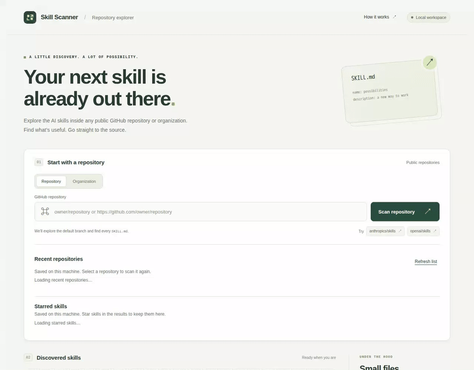

# Starred skills demonstration

[Watch the MP4 version](starred-skills.mp4).

This recording comes from the passing
[starred skills E2E test](../../tests/e2e/starred-skills.spec.mjs),
with baseline updates disabled. The [recording manifest](starred-skills.json)
identifies the tested source revision, pinned browser environment, screenshot
checkpoints, pass result, and media hashes. A later media-only commit adds the
recording without changing the tested source or baselines.

The test drives the rebuilt executable using
[local scan fixtures](../../tests/e2e/fixtures/scans.json), isolated history,
starred, and cache directories, and no credentials or live GitHub access. Only
scan responses and their history writes are mocked; starring, unstarring,
listing, server restarts, and CLI reads use the actual application and
persistent storage.

Nine [reviewed screenshot baselines](../../tests/e2e/snapshots/starred-skills.spec.mjs)
cover unstarred results, starring a skill, the starred-only filter, stars across
repositories, restart persistence, a rescan keeping the star, unstarring from a
card, unstarring from the list, and persistent removal after another restart.
Behavioral assertions run before each comparison, including keyboard starring
with retained focus and the CLI's view of the same stars.

Follow the [setup and exact reproduction commands](../../tests/e2e/README.md)
to run the test and export its video. The MP4 and inline GIF are conversions of
the same passing run, with the tested sequence and outcome preserved. CI runs
the same test and retains its report, video, and failure diagnostics.
